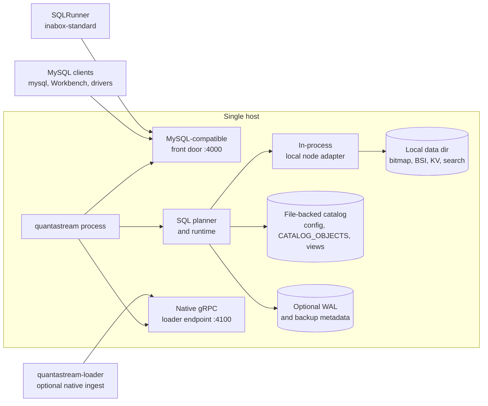
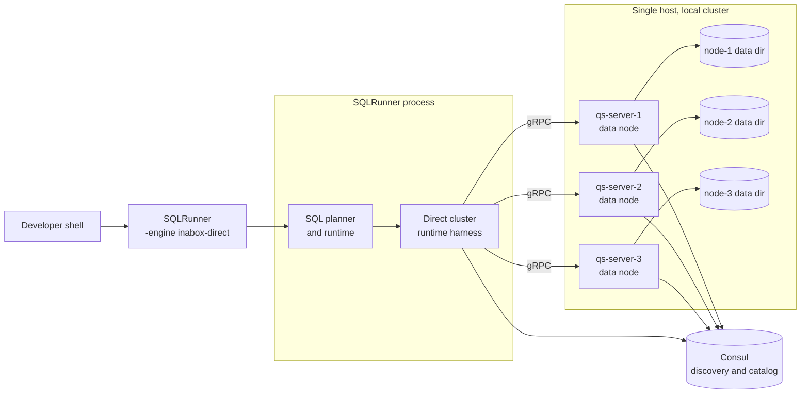
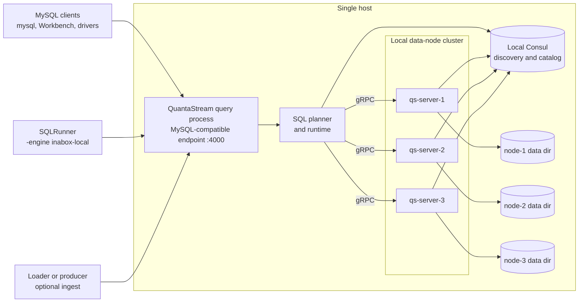
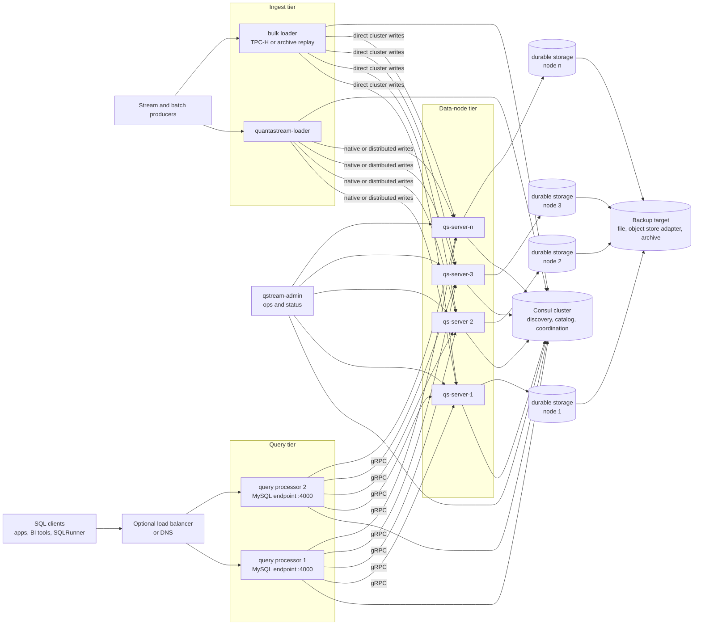

# Deployment Diagrams

These diagrams describe the current QuantaStream deployment topologies. The
mode names match existing scripts, SQLRunner engine flags, and compatibility
profiles. For prose guidance, see [DEPLOYMENT.md](DEPLOYMENT.md).

GitHub renders the diagrams from Mermaid source.

## QIAB Single-Node: `inabox-standard`

`inabox-standard` is the product-facing Quanta-in-a-Box shape. One
`quantastream` process owns the MySQL-compatible front door, SQL runtime,
in-process node adapter, catalog files, and local storage. It does not require
Consul.

Operational notes:

- simplest local and small-deployment topology;
- one process lifecycle;
- no Consul requirement;
- no query-engine-to-node network hop;
- backup, WAL, and catalog files live with the local data directory.

## QIAB Direct-Cluster Harness: `inabox-direct`

`inabox-direct` is a development and conformance harness. SQLRunner hosts the
query engine in its own process and talks directly to a local data-node cluster
through the distributed gRPC path. There is no MySQL-compatible front door in
this topology.

Operational notes:

- exercises distributed nodes, storage ownership, and Consul-backed metadata;
- avoids the MySQL wire path;
- useful for targeted SQLRuntime and node behavior debugging;
- not the user-facing QIAB product path.

## QIAB Local Distributed Shape: `inabox-local`

`inabox-local` keeps everything on one host but preserves the normal distributed
service boundary: MySQL clients talk to a local query front door, and the query
front door talks to local data nodes through Consul discovery and gRPC.

Operational notes:

- validates the MySQL wire path plus distributed node RPC on a laptop;
- requires local Consul;
- useful for catalog propagation, service discovery, gRPC, and startup testing;
- does not validate multi-host networking or host replacement procedures.

## Full Distributed Mode

Full distributed mode separates query processors, data nodes, loaders, durable
storage, and service discovery across hosts. This is the scale-out topology
used for AWS benchmark and production-style validation.

Operational notes:

- query processors and loaders are horizontally deployable front-end services;
- data nodes own shards and durable node-local or attached storage;
- Consul currently provides service discovery and distributed catalog metadata;
- node identity and durable storage must be managed together;
- backup/restore, failover, node replacement, rebalancing, and rolling upgrade
  runbooks are operational gates for production-grade distributed deployments.
